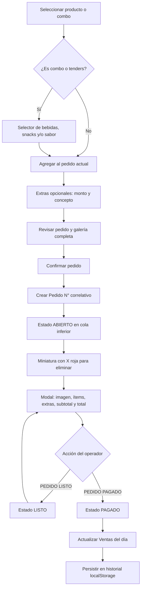

# Freeze Monkey POS

Punto de venta local hecho con HTML, CSS, Tailwind CDN y JavaScript ES6+. Todos los archivos del sitio están en esta carpeta. El catálogo usa las 27 fotografías proporcionadas en `assets/img/productos/`.

## Abrir localmente

Abre `index.html` con doble clic en tu navegador. El catálogo, las fechas y todas las acciones se cargan desde scripts locales, compatibles con `file://`, sin instalar nada ni iniciar un servidor. Conserva las carpetas `js`, `css` y `assets` junto al archivo HTML.

También puedes ejecutar `python3 -m http.server 8000` desde `freeze-monkey-pos/` y abrir `http://localhost:8000`. En GitHub Pages, publica esta carpeta como raíz del sitio o cópiala a la raíz de la rama publicada. Tailwind y la fuente Inter usan CDN; su disponibilidad no impide iniciar el POS y el CSS local mantiene la interfaz utilizable sin ellos.

Los datos se guardan por navegador y ubicación: si pasas de `file://` a `localhost` o GitHub Pages, exporta el expediente JSON desde la ubicación anterior e impórtalo en la nueva.

## Operación

1. Toca un producto. Los productos individuales entran directamente al pedido actual; combos y tenders abren un selector sin salir del menú.
2. Agrega extras con monto positivo y concepto. Se suman al subtotal en tiempo real.
3. Pulsa **Crear pedido** para revisar todos los productos, extras y el total. Esta pantalla muestra una galería completa y únicamente el botón **Confirmar pedido**. Hasta confirmarlo, puedes cerrar la revisión y seguir editando el pedido actual. Al confirmar, se asigna un número correlativo persistente y estado `ABIERTO`.
4. Abre la miniatura en la cola inferior para ver el desglose y añadir o quitar extras. `PEDIDO LISTO` cambia el estado a `LISTO`; `PEDIDO PAGADO` registra la fecha de pago, cierra la cola y actualiza **Ventas del día**.
5. La X roja elimina un pedido abierto tras confirmar. El número correlativo no se reutiliza.
6. **Historial** muestra los pedidos guardados, incluidos los pagados. **Guardar expediente** descarga JSON. **Opciones** permite descargar JSON, exportar CSV compatible con Excel e importar un expediente JSON o CSV generado por este POS. La importación reemplaza los datos locales tras confirmar.
7. La cola inferior es compacta. Cada pedido muestra hasta 4 miniaturas; a partir de 5 ítems, muestra 3 miniaturas y `+N` con la cantidad restante. El botón de flecha hacia abajo oculta la barra y deja una pestaña **Pedidos** para volver a mostrarla. El navegador recuerda esa preferencia.

Los datos quedan en `localStorage` de este navegador y origen. Guarda copias JSON periódicas; no hay sincronización entre dispositivos ni integración con una terminal de cobro. El botón `PEDIDO PAGADO` registra un pago indicado por el operador.

## Catálogo y reglas

- Bebidas: $60. Los nombres de frappés y smoothies vienen de los archivos proporcionados. Hay dos limonadas: **Limonada de Fresa** y **Limonada Azul**, ambas a $60 y con imagen pendiente. Para añadir sus fotografías, colócalas en `assets/img/productos/` y cambia su ruta `image` en `js/menuData.js`.
- Snacks: $40, salvo dedos de queso a $50. Tenders naturales, BBQ o búfalo: $70.
- Caja Salvaje: $179, como producto individual en **Snacks**. No pertenece a los combos ni sustituye un snack incluido en ellos.
- Combo Viral: $95. Se interpreta como 1 bebida y 1 snack, dado que la cantidad no estaba especificada.
- Combo Ozaru: $180, con 2 bebidas y 2 snacks a elección.
- Combo Manada: $289, con platón de snacks y 2 bebidas. Para mostrar un desglose que sume $289, el platón se presenta con una **asignación interna derivada de $169**; no se ofrece como precio unitario.
- Combo Tender: $120, con tenders de sabor elegido y 1 bebida.

El precio final de cada combo es fijo. El detalle muestra el valor unitario de los componentes conocidos y un ajuste del combo; elegir dedos de queso no cambia el precio fijo.

## Flujo de un pedido

## Decisiones de interacción

Se usan tarjetas grandes de un toque, filtros visibles, selección requerida dentro de combos, un panel de pedido que siempre muestra el total y acciones de estado grandes. La [biblioteca de patrones de Mobbin](https://mobbin.com/) clasifica patrones como añadir al carrito, diálogos y hojas inferiores; no se pudo verificar una pantalla concreta de Square, Clover o Toast dentro de Mobbin desde este entorno. Como contraste funcional, la [documentación de Square](https://squareup.com/help/us/en/article/8634-customize-item-details-settings) describe añadir artículos directamente cuando no requieren variantes y abrir detalles cuando sí las requieren. [Square también documenta combos](https://squareup.com/help/us/en/article/8558-create-and-sell-combos), y [Clover documenta grupos de modificadores](https://docs.clover.com/dev/docs/managing-modifier-groups-modifiers). La interfaz aplica esos principios a los bocetos proporcionados.

La tipografía es Inter con fallback del sistema; sus cifras y rótulos mantienen buena lectura en botones y totales. Los colores se tomaron de los bocetos: azul marino `#0F2B5C`, café `#8A7659`, beige `#B69A6B`, amarillo `#FFDF63`, verde `#08BF70` y rojo `#F84443`.

## Estructura

- `index.html`: interfaz y diálogos.
- `css/styles.css`: maquetación adaptable y colores.
- `js/menuData.js`: catálogo, precios y validación de combos.
- `js/posEngine.js`: selección, extras, pedidos, cola y vistas.
- `js/storage.js`: persistencia y expediente JSON / CSV.
- `assets/img/productos/`: imágenes locales.

## Publicación

El sitio no tiene backend y puede servirse como archivos estáticos. Antes de usarlo en producción, confirma que el alojamiento elegido permite el uso comercial previsto y que los equipos de caja cuentan con respaldos periódicos. Los datos guardados en un navegador no aparecerán en otro.
